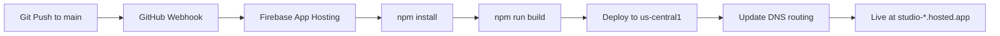

# Deployment Guide

## 🚀 Current Deployment Architecture

**Platform**: Firebase App Hosting  
**Project**: `drivemind-q69b7`  
**URL**: https://studio--drivemind-q69b7.us-central1.hosted.app  
**Account**: scott.presley@gmail.com  
**Auto-Deploy**: ✅ Enabled (pushes to `main` trigger deployment)

## 📋 Environment Status

### Production Environment
```yaml
Project ID: drivemind-q69b7
Region: us-central1
Runtime: Node.js 18
Framework: Next.js 14
Database: Firestore
Authentication: Firebase Auth + Google OAuth
```

### Secrets Configuration
```bash
# Stored in Firebase App Hosting Secrets
GOOGLE_OAUTH_CLIENT_ID=123456789-abcdef.apps.googleusercontent.com
GOOGLE_OAUTH_CLIENT_SECRET=GOCSPX-secretkeyhere

# Auto-provided by App Hosting
GOOGLE_APPLICATION_CREDENTIALS=/workspace/.config/gcloud/application_default_credentials.json
```

## 🔧 Deployment Configuration

### apphosting.yaml
```yaml
# Located at project root
runConfig:
  runtime: nodejs18
  
env:
  - variable: NODE_ENV
    value: production
    
secrets:
  - variable: GOOGLE_OAUTH_CLIENT_ID
    secret: GOOGLE_OAUTH_CLIENT_ID
    availability: [RUNTIME]
  - variable: GOOGLE_OAUTH_CLIENT_SECRET
    secret: GOOGLE_OAUTH_CLIENT_SECRET
    availability: [RUNTIME]
```

### package.json Scripts
```json
{
  "scripts": {
    "build": "next build",
    "start": "next start",
    "dev": "next dev",
    "lint": "next lint",
    "typecheck": "tsc --noEmit"
  }
}
```

## 📦 Deployment Process

### Automatic Deployment (Current)


**Timeline**: 3-5 minutes from push to live

### Manual Deployment Commands
```bash
# 1. Ensure you're on the correct Firebase project
npx firebase use drivemind-q69b7

# 2. Check current backend status
npx firebase apphosting:backends:list

# 3. Trigger manual deployment (if needed)
npx firebase apphosting:backends:update studio

# 4. Monitor deployment progress
npx firebase apphosting:deployments:list studio
```

### Staging Config (optional)
You can deploy with a staging configuration that enables file operations via feature flags.

Files:
- `apphosting.yaml` (production defaults, file ops disabled)
- `apphosting.staging.yaml` (staging, file ops enabled)

Deploy staging config:
```bash
# Copy staging config into place for a one-off deploy
cp apphosting.staging.yaml apphosting.yaml
npx firebase apphosting:backends:update studio

# After testing, revert to production config
git checkout -- apphosting.yaml
```

## 🔍 Verification & Testing

### Health Check Endpoints
```bash
# Basic health check
curl https://studio--drivemind-q69b7.us-central1.hosted.app/about

# API health check
curl https://studio--drivemind-q69b7.us-central1.hosted.app/api/auth/drive/status

# Firebase config check (if endpoint exists)
curl https://studio--drivemind-q69b7.us-central1.hosted.app/api/debug/config
```

### Post-Deployment Testing
```bash
# Set your base URL and token
export BASE_URL=https://studio--drivemind-q69b7.us-central1.hosted.app
export FIREBASE_ID_TOKEN=<paste a valid token>

# Health & Metrics
curl -s "$BASE_URL/api/health" | jq .
curl -s "$BASE_URL/api/metrics" | jq .

# Drive status (should be connected)
curl -s -H "Authorization: Bearer $FIREBASE_ID_TOKEN" \
  "$BASE_URL/api/auth/drive/status" | jq .

# Start background scan
curl -s -X POST \
  -H "Authorization: Bearer $FIREBASE_ID_TOKEN" \
  -H "Content-Type: application/json" \
  -d '{"type":"full_analysis","config":{"includeTrashed":false}}' \
  "$BASE_URL/api/workflows/background-scan" | jq .

# Poll scan status
curl -s -H "Authorization: Bearer $FIREBASE_ID_TOKEN" \
  "$BASE_URL/api/workflows/background-scan" | jq .
```

### CI Workflows
- Post-deploy health: `.github/workflows/post-deploy-health.yml` (auto on push to main, or manual)
- Background scan smoke (manual only): `.github/workflows/post-deploy-scan-smoke.yml`
  - Requires `SCAN_TEST_ID_TOKEN` repo/org secret or pass a one-off token input
  - Usage: Actions → Post-Deploy Scan Smoke → Run workflow

### Frontend Testing Checklist
- [ ] Page loads without errors
- [ ] Firebase Auth sign-in works
- [ ] Google Drive OAuth flow completes
- [ ] Background scan buttons trigger API calls
- [ ] Progress updates display correctly
- [ ] Error messages are user-friendly
 - [ ] Health endpoint returns healthy or degraded
 - [ ] Metrics endpoint returns JSON and Prometheus formats

## 🔒 Security Configuration

### Firebase Security Rules
**Firestore Rules** (auto-applied):
```javascript
rules_version = '2';
service cloud.firestore {
  match /databases/{database}/documents {
    // Users can only access their own data
    match /users/{userId}/{document=**} {
      allow read, write: if request.auth != null && request.auth.uid == userId;
    }
    
    // Scan jobs restricted to owner
    match /scanJobs/{scanId} {
      allow read, write: if request.auth != null && 
        request.auth.uid == resource.data.uid;
    }
    
    // File index restricted to owner
    match /fileIndex/{fileId} {
      allow read, write: if request.auth != null && 
        request.auth.uid == resource.data.uid;
    }
    
    // Scan deltas restricted to owner
    match /scanDeltas/{deltaId} {
      allow read, write: if request.auth != null && 
        request.auth.uid == resource.data.uid;
    }
  }
}
```

### Environment Security
```bash
# Production settings
NODE_ENV=production
NEXT_TELEMETRY_DISABLED=1

# Secure headers (handled by Next.js)
X-Frame-Options: DENY
X-Content-Type-Options: nosniff
Referrer-Policy: origin-when-cross-origin
```

## 📊 Monitoring & Logging

### Firebase Console Monitoring
- **Performance**: https://console.firebase.google.com/project/drivemind-q69b7/performance
- **Logs**: https://console.firebase.google.com/project/drivemind-q69b7/functions/logs  
- **Auth**: https://console.firebase.google.com/project/drivemind-q69b7/authentication
- **Firestore**: https://console.firebase.google.com/project/drivemind-q69b7/firestore

### Log Structure
```typescript
// Server-side logging pattern
logger.info('🔍 Operation started', { uid, operation: 'background-scan' });
logger.warn('⚠️ Potential issue detected', { details: errorInfo });
logger.error('💥 Operation failed', { error: error.message, stack: error.stack });
```

### Key Metrics to Monitor
```typescript
interface DeploymentMetrics {
  responseTime: number;        // API response times
  errorRate: number;          // 4xx/5xx error percentage  
  throughput: number;         // Requests per minute
  memoryUsage: number;        // Memory consumption
  scanDuration: number;       // Background scan completion times
  oauthSuccessRate: number;   // OAuth completion percentage
}
```

## 🔄 Rollback Procedures

### Quick Rollback (Emergency)
```bash
# 1. Find the last good commit
git log --oneline -10

# 2. Revert to previous commit
git revert HEAD
git push origin main

# 3. Monitor deployment (3-5 minutes)
npx firebase apphosting:backends:get studio
```

### Staged Rollback (Controlled)
```bash
# 1. Create rollback branch
git checkout -b rollback-to-working-state
git reset --hard LAST_GOOD_COMMIT_HASH

# 2. Test locally
npm run build
npm run start

# 3. Deploy rollback
git push origin rollback-to-working-state

# 4. Merge to main when confirmed working
git checkout main
git merge rollback-to-working-state
git push origin main
```

### Database Rollback (If Needed)
```bash
# Firestore doesn't have automatic backups, but we can:
# 1. Export current state
npx firebase firestore:export gs://drivemind-backup/$(date +%Y%m%d)

# 2. If rollback needed, restore from backup
npx firebase firestore:import gs://drivemind-backup/BACKUP_DATE
```

## 🛠️ Development Workflow

### Local Development Setup
```bash
# 1. Clone repository
git clone https://github.com/VT-TyR/DriveMind.git
cd DriveMind

# 2. Install dependencies
npm install

# 3. Configure environment
cp .env.example .env.local
# Edit .env.local with local development values

# 4. Start development server
npm run dev

# 5. Open browser
open http://localhost:3000
```

### Environment Variables (Local)
```bash
# .env.local
NEXT_PUBLIC_BASE_URL=http://localhost:3000
GOOGLE_OAUTH_CLIENT_ID=your-client-id
GOOGLE_OAUTH_CLIENT_SECRET=your-client-secret
NEXT_PUBLIC_FIREBASE_CONFIG={"projectId":"drivemind-q69b7",...}

# Firebase Admin (for local testing)
GOOGLE_APPLICATION_CREDENTIALS=/path/to/service-account-key.json
```

### Pre-Deployment Testing
```bash
# 1. Run type checking
npm run typecheck

# 2. Run linting
npm run lint

# 3. Test build
npm run build

# 4. Test production build locally
npm run start

# 5. Run integration tests (if available)
npm run test
```

## 📋 Staging Changes (Current State)

### Staged But Not Deployed
```bash
# Check what's staged for next deployment
git status

# Current staged changes (as of Sept 6, 2025):
# - Firebase Admin fixes in src/lib/firebase-db.ts
# - Remaining client-side Firebase calls converted to Admin SDK
# - These changes should resolve the 500 errors in background scans
```

### To Deploy Staged Changes
```bash
# CRITICAL: Deploy these fixes to resolve 500 errors
git add src/lib/firebase-db.ts
git commit -m "Fix remaining Firebase Admin calls for background scan system"
git push origin main

# Monitor deployment (3-5 minutes)
watch -n 30 'curl -I https://studio--drivemind-q69b7.us-central1.hosted.app/about'
```

## 🚨 Emergency Procedures

### System Down
1. **Check Firebase Status**: https://status.firebase.google.com/
2. **Check GitHub Status**: https://www.githubstatus.com/
3. **Verify Domain**: `nslookup studio--drivemind-q69b7.us-central1.hosted.app`
4. **Check recent deployments**: `npx firebase apphosting:backends:get studio`

### Database Issues
```bash
# Check Firestore status
npx firebase firestore:indexes:list

# Test database connectivity
curl -X POST https://studio--drivemind-q69b7.us-central1.hosted.app/api/test/firestore

# Check security rules
npx firebase firestore:rules:get
```

### OAuth Issues
```bash
# Check Google Cloud Console OAuth settings
# https://console.cloud.google.com/apis/credentials?project=drivemind-q69b7

# Verify redirect URIs are correct
# Test OAuth flow manually
curl -X POST https://studio--drivemind-q69b7.us-central1.hosted.app/api/auth/drive/begin
```

## 📞 Support & Resources

### Firebase Support
- **Console**: https://console.firebase.google.com/project/drivemind-q69b7
- **Documentation**: https://firebase.google.com/docs/app-hosting
- **Status**: https://status.firebase.google.com/

### Google Cloud Support  
- **Console**: https://console.cloud.google.com/home/dashboard?project=drivemind-q69b7
- **OAuth Console**: https://console.cloud.google.com/apis/credentials?project=drivemind-q69b7
- **API Quotas**: https://console.cloud.google.com/apis/dashboard?project=drivemind-q69b7

### Development Resources
- **Repository**: https://github.com/VT-TyR/DriveMind
- **Issues**: https://github.com/VT-TyR/DriveMind/issues
- **Next.js Docs**: https://nextjs.org/docs

## 🔄 Recent Deployment History

### September 6, 2025
- **805a072**: Implement comprehensive OAuth token persistence  
- **b9c364c**: Fix 500 error: Replace client-side Firebase with Firebase Admin
- **9989a89**: Add client-side debugging to scan buttons
- **444c0f3**: Various background scan system improvements

### Key Changes Since Last Working State
1. ✅ OAuth persistence system implemented
2. ✅ Firebase Admin SDK migration (partial)
3. ⚠️ **PENDING**: Final Firebase Admin fixes in firebase-db.ts
4. ⚠️ **ISSUE**: Background scan 500 errors (fix staged)

### Next Deployment Priority
```bash
# IMMEDIATE ACTION REQUIRED
# Deploy staged Firebase Admin fixes to resolve 500 errors
git add .
git commit -m "Complete Firebase Admin migration for background scans"
git push origin main
```

---

**🔄 Last Updated**: September 6, 2025  
**⚡ Status**: Staged changes ready for deployment  
**🎯 Priority**: Deploy Firebase Admin fixes to resolve background scan 500 errors  
**📞 Emergency Contact**: scott.presley@gmail.com
