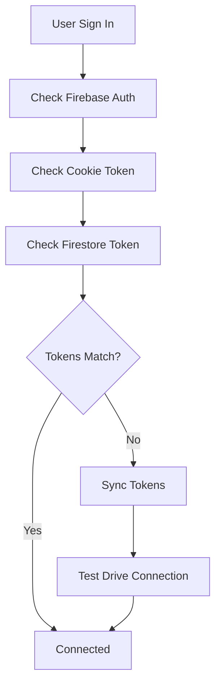

# DriveMind Technical Deep Dive

## 🏗️ System Architecture

### High-Level Overview
```
┌─────────────────┐    ┌──────────────────┐    ┌─────────────────┐
│   Next.js App   │────│  Firebase Auth   │────│  Google Drive   │
│  (Frontend)     │    │   & Firestore    │    │      API        │
└─────────────────┘    └──────────────────┘    └─────────────────┘
         │                        │                       │
         │              ┌─────────────────┐               │
         └──────────────│ Background Scan │───────────────┘
                        │   Processing    │
                        └─────────────────┘
```

### Technology Stack
- **Frontend**: Next.js 14, TypeScript, Tailwind CSS, shadcn/ui
- **Backend**: Next.js API Routes, Firebase Admin SDK
- **Database**: Firestore (Firebase)
- **Authentication**: Firebase Auth + Google OAuth 2.0
- **External API**: Google Drive API v3
- **Deployment**: Firebase App Hosting
- **State Management**: React Context API

## 🔐 Authentication & Authorization Flow

### Dual Authentication System
The system uses a sophisticated dual authentication approach:

1. **Firebase Authentication**: User identity and session management
2. **Google OAuth**: Google Drive API access permissions

### OAuth Token Storage Architecture
```typescript
// Cookie Storage (Browser Sessions)
Cookie: google_refresh_token (30 days, httpOnly, secure)

// Firestore Storage (Server-Side Operations)  
Collection: users/{uid}/secrets
Document: googleDrive
Fields: { refreshToken: string, updatedAt: Date }

// In-Memory Cache (Performance)
Map<uid, {token: string, timestamp: number}>
```

### Token Synchronization Flow


## 🔄 Background Scan System Architecture

### Scan Job Lifecycle
```typescript
interface ScanJob {
  id: string;
  uid: string;
  status: 'pending' | 'running' | 'completed' | 'failed' | 'cancelled';
  type: 'drive_scan' | 'full_analysis' | 'duplicate_detection';
  progress: {
    current: number;
    total: number;
    percentage: number;
    currentStep: string;
    estimatedTimeRemaining?: number;
    bytesProcessed?: number;
    totalBytes?: number;
  };
  config: {
    maxDepth?: number;
    includeTrashed?: boolean;
    rootFolderId?: string;
    fileTypes?: string[];
  };
  results?: {
    scanId?: string;
    filesFound?: number;
    duplicatesDetected?: number;
    totalSize?: number;
    insights?: ScanInsights;
  };
  error?: string;
  createdAt: number;
  updatedAt: number;
  startedAt?: number;
  completedAt?: number;
}
```

### Async Processing Pattern
```typescript
// API Route Pattern
export async function POST(request: NextRequest) {
  // 1. Authenticate user
  const uid = await verifyFirebaseToken(token);
  
  // 2. Create scan job (synchronous)
  const jobId = await createScanJob(uid, type, config);
  
  // 3. Start background processing (async, don't await)
  processBackgroundScan(uid, jobId, type, config).catch(error => {
    failScanJob(jobId, error.message);
  });
  
  // 4. Return immediately
  return NextResponse.json({ jobId, status: 'pending' });
}
```

### Real-Time Progress Updates
```typescript
// Frontend Polling Pattern
useEffect(() => {
  const interval = setInterval(async () => {
    const response = await fetch('/api/workflows/background-scan', {
      headers: { 'Authorization': `Bearer ${token}` }
    });
    const scanStatus = await response.json();
    
    if (scanStatus.status !== 'running') {
      clearInterval(interval);
    }
    
    setActiveScanJob(scanStatus);
  }, 2000); // Poll every 2 seconds
  
  return () => clearInterval(interval);
}, [user]);
```

## 📊 Database Schema & Collections

### Firestore Collections Structure
```
drivemind-q69b7/
├── scanJobs/                    # Background scan tracking
│   ├── {jobId}/
│   │   ├── id: string
│   │   ├── uid: string
│   │   ├── status: enum
│   │   ├── progress: object
│   │   ├── results: object
│   │   └── timestamps: numbers
│   │
├── fileIndex/                   # File metadata for delta scans
│   ├── {uid}_{fileId}/
│   │   ├── id: string (Google Drive file ID)
│   │   ├── uid: string
│   │   ├── name: string
│   │   ├── mimeType: string
│   │   ├── size: number
│   │   ├── modifiedTime: string
│   │   ├── md5Checksum?: string
│   │   ├── lastScanId: string
│   │   └── isDeleted: boolean
│   │
├── scanDeltas/                  # Change tracking
│   ├── {deltaId}/
│   │   ├── uid: string
│   │   ├── scanId: string
│   │   ├── type: 'created' | 'modified' | 'deleted'
│   │   ├── fileId: string
│   │   ├── fileName: string
│   │   └── timestamp: number
│   │
└── users/                       # User-specific data
    └── {uid}/
        └── secrets/
            └── googleDrive/
                ├── refreshToken: string
                └── updatedAt: Date
```

### Key Database Operations
```typescript
// Firebase Admin SDK Patterns (Server-Side)
const db = getAdminFirestore();

// Create with auto-ID
const docRef = await db.collection('scanJobs').add(data);

// Update existing document  
await db.collection('scanJobs').doc(jobId).update(updates);

// Complex query
const snapshot = await db.collection('scanJobs')
  .where('uid', '==', uid)
  .where('status', 'in', ['pending', 'running'])
  .orderBy('createdAt', 'desc')
  .limit(1)
  .get();

// Batch operations
const batch = db.batch();
batch.set(docRef1, data1);
batch.update(docRef2, data2);
await batch.commit();
```

## 🔧 Google Drive API Integration

### Drive Client Creation Pattern
```typescript
export async function driveFor(uid: string) {
  // 1. Get refresh token from Firestore
  const refreshToken = await getUserRefreshToken(uid);
  if (!refreshToken) {
    throw new Error('No Google Drive connection');
  }
  
  // 2. Create OAuth client with stored token
  const oauth = getOAuthClient();
  oauth.setCredentials({ refresh_token: refreshToken });
  
  // 3. Return authenticated Drive client
  return google.drive({ version: "v3", auth: oauth });
}
```

### Paginated File Retrieval
```typescript
async function scanAllFiles(drive, config) {
  const allFiles = [];
  let pageToken = undefined;
  
  do {
    const response = await drive.files.list({
      pageSize: 1000, // Maximum allowed
      pageToken,
      q: config.includeTrashed ? undefined : 'trashed = false',
      fields: 'nextPageToken, files(id, name, mimeType, size, modifiedTime, parents, md5Checksum)',
      includeItemsFromAllDrives: true,
      supportsAllDrives: true,
    });
    
    allFiles.push(...(response.data.files || []));
    pageToken = response.data.nextPageToken;
    
    // Rate limiting
    if (pageToken) {
      await new Promise(resolve => setTimeout(resolve, 100));
    }
  } while (pageToken);
  
  return allFiles;
}
```

### Duplicate Detection Algorithm
```typescript
function findDuplicates(files: any[]): any[][] {
  const duplicateGroups: any[][] = [];
  const sizeGroups = new Map<string, any[]>();

  // Group by file size first (fast)
  for (const file of files) {
    const size = file.size || '0';
    if (!sizeGroups.has(size)) {
      sizeGroups.set(size, []);
    }
    sizeGroups.get(size)!.push(file);
  }

  // Check groups with multiple files
  for (const [size, groupFiles] of sizeGroups) {
    if (groupFiles.length > 1 && size !== '0') {
      // Sub-group by MD5 checksum or normalized name
      const nameGroups = new Map<string, any[]>();
      
      for (const file of groupFiles) {
        const key = file.md5Checksum || 
                   file.name.toLowerCase().replace(/[^a-z0-9]/g, '');
        if (!nameGroups.has(key)) {
          nameGroups.set(key, []);
        }
        nameGroups.get(key)!.push(file);
      }

      // Add groups with actual duplicates
      for (const [, nameGroup] of nameGroups) {
        if (nameGroup.length > 1) {
          duplicateGroups.push(nameGroup);
        }
      }
    }
  }

  return duplicateGroups;
}
```

## 🔍 Delta Scanning System

### Delta vs Full Scan Decision Logic
```typescript
export async function shouldRunFullScan(uid: string) {
  // Check last scan time
  const lastScanTime = await getLastScanTimestamp(uid);
  if (!lastScanTime) {
    return { shouldRunFull: true, reason: 'No previous scan' };
  }
  
  // Check scan age (7 days threshold)
  const daysSince = (Date.now() - new Date(lastScanTime).getTime()) / (24*60*60*1000);
  if (daysSince > 7) {
    return { shouldRunFull: true, reason: 'Scan too old' };
  }
  
  // Check file index completeness
  const indexedFileCount = await getIndexedFileCount(uid);
  if (indexedFileCount < 100) {
    return { shouldRunFull: true, reason: 'Index incomplete' };
  }
  
  return { shouldRunFull: false, reason: 'Delta scan sufficient' };
}
```

### File Index Update Process  
```typescript
export async function updateFileIndex(uid: string, files: any[], scanId: string) {
  const batch = db.batch();
  const stats = { created: 0, updated: 0, deleted: 0 };
  
  // Get existing index
  const existingFiles = await getCurrentFileIndex(uid);
  const scannedFileIds = new Set(files.map(f => f.id));
  
  // Process scanned files
  for (const file of files) {
    const existing = existingFiles.get(file.id);
    const fileEntry = buildFileIndexEntry(uid, file, scanId);
    
    if (existing) {
      if (hasFileChanged(existing, fileEntry)) {
        // Create change delta
        await createDelta(batch, uid, scanId, 'modified', file, existing);
        // Update index
        await updateIndexEntry(batch, uid, file.id, fileEntry);
        stats.updated++;
      }
    } else {
      // New file
      await createDelta(batch, uid, scanId, 'created', file);
      await createIndexEntry(batch, uid, file.id, fileEntry);
      stats.created++;
    }
  }
  
  // Mark missing files as deleted
  for (const [fileId, existing] of existingFiles) {
    if (!scannedFileIds.has(fileId) && !existing.isDeleted) {
      await createDelta(batch, uid, scanId, 'deleted', { id: fileId, name: existing.name });
      await markAsDeleted(batch, uid, fileId, scanId);
      stats.deleted++;
    }
  }
  
  await batch.commit();
  return stats;
}
```

## 🚀 Deployment & Infrastructure

### Firebase App Hosting Configuration
```yaml
# apphosting.yaml
runConfig:
  runtime: nodejs18
  
env:
  - variable: NODE_ENV
    value: production
    
secrets:
  - variable: GOOGLE_OAUTH_CLIENT_ID
    secret: GOOGLE_OAUTH_CLIENT_ID
    availability: [RUNTIME]
  - variable: GOOGLE_OAUTH_CLIENT_SECRET
    secret: GOOGLE_OAUTH_CLIENT_SECRET
    availability: [RUNTIME]
```

### Build Process
```bash
# Automatic on git push
1. GitHub webhook triggers Firebase App Hosting
2. npm install (dependencies)
3. npm run build (Next.js build)
4. Deploy to us-central1
5. Update DNS routing
6. ~3-5 minute total time
```

### Environment Variables Resolution
```typescript
// Development
process.env.GOOGLE_OAUTH_CLIENT_ID // From .env.local

// Production (Firebase App Hosting)
process.env.GOOGLE_OAUTH_CLIENT_ID // From Firebase secrets
process.env.GOOGLE_APPLICATION_CREDENTIALS // Auto-provided by App Hosting
```

## 🐛 Error Handling Patterns

### API Route Error Handling
```typescript
export async function POST(request: NextRequest) {
  try {
    // Business logic here
    return NextResponse.json({ success: true });
  } catch (error) {
    const errorMessage = error instanceof Error ? error.message : 'Unknown error';
    const errorStack = error instanceof Error ? error.stack : undefined;
    
    logger.error(`API Error: ${errorMessage}`, { stack: errorStack });
    
    return NextResponse.json(
      { 
        error: 'Operation failed', 
        details: errorMessage,
        timestamp: new Date().toISOString()
      },
      { status: 500 }
    );
  }
}
```

### Firebase Admin Error Recovery
```typescript
export function getAdminFirestore() {
  if (adminFirestore) return adminFirestore;
  
  try {
    const { getFirestore } = require('firebase-admin/firestore');
    adminFirestore = getFirestore(getAdminApp());
    return adminFirestore;
  } catch (error) {
    logger.error('Failed to initialize Firebase Admin Firestore', error);
    throw new Error('Database connection failed');
  }
}
```

### Frontend Error Boundaries
```typescript
// Context-level error handling
const [error, setError] = useState<string | null>(null);

const handleApiCall = async () => {
  try {
    setError(null);
    const result = await apiCall();
    return result;
  } catch (error) {
    const message = error instanceof Error ? error.message : 'Unknown error';
    setError(message);
    console.error('Operation failed:', error);
  }
};
```

## 📈 Performance Optimizations

### Database Query Optimization
```typescript
// Good: Single compound query
const activeScans = await db.collection('scanJobs')
  .where('uid', '==', uid)
  .where('status', 'in', ['pending', 'running'])
  .orderBy('createdAt', 'desc')
  .limit(1)
  .get();

// Bad: Multiple queries
const allScans = await db.collection('scanJobs').where('uid', '==', uid).get();
const activeScans = allScans.docs.filter(doc => 
  ['pending', 'running'].includes(doc.data().status)
);
```

### Caching Strategy
```typescript
// In-memory token cache (5 minute TTL)
const tokenCache: Map<string, {token: string, timestamp: number}> = new Map();

export async function getUserRefreshToken(uid: string): Promise<string | null> {
  // Check cache first
  const cached = tokenCache.get(uid);
  if (cached && Date.now() - cached.timestamp < 5 * 60 * 1000) {
    return cached.token;
  }
  
  // Fallback to Firestore
  const token = await fetchFromFirestore(uid);
  if (token) {
    tokenCache.set(uid, { token, timestamp: Date.now() });
  }
  
  return token;
}
```

### Rate Limiting & Throttling
```typescript
// Google Drive API rate limiting
const RATE_LIMIT_DELAY = 100; // ms between requests

for (let i = 0; i < batches.length; i++) {
  const batch = batches[i];
  await processBatch(batch);
  
  if (i < batches.length - 1) {
    await new Promise(resolve => setTimeout(resolve, RATE_LIMIT_DELAY));
  }
}
```

## 🔬 Testing & Debugging

### API Testing Commands
```bash
# Test OAuth status
curl -H "Authorization: Bearer FIREBASE_TOKEN" \
  https://studio--drivemind-q69b7.us-central1.hosted.app/api/auth/drive/status

# Test background scan
curl -X POST \
  -H "Authorization: Bearer FIREBASE_TOKEN" \
  -H "Content-Type: application/json" \
  -d '{"type":"full_analysis","config":{"maxDepth":20}}' \
  https://studio--drivemind-q69b7.us-central1.hosted.app/api/workflows/background-scan

# Check scan progress  
curl -H "Authorization: Bearer FIREBASE_TOKEN" \
  https://studio--drivemind-q69b7.us-central1.hosted.app/api/workflows/background-scan
```

### Frontend Debugging
```typescript
// Enhanced debugging in startBackgroundScan
console.log('🔥 Scan button clicked!');
console.log('🔄 Getting Firebase token...');
console.log('📡 Making API request...');
console.log('📬 Response:', response.status, result);
```

### Server-Side Logging
```typescript
// Structured logging throughout API routes
logger.info('📡 Background scan API called');
logger.info(`🔑 Token received, length: ${token.length}`);
logger.info(`✅ Firebase user verified: ${uid}`);
logger.error(`💥 Operation failed: ${error.message}`);
```

---

**🔄 Last Updated**: September 6, 2025  
**📚 Related Docs**: OAUTH_SYSTEM_GUIDE.md, BACKGROUND_SCAN_GUIDE.md  
**🎯 Status**: Core architecture implemented, final fixes staged for deployment