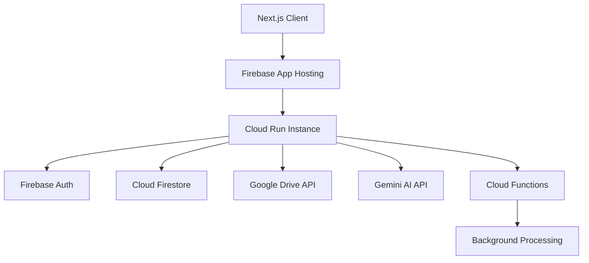
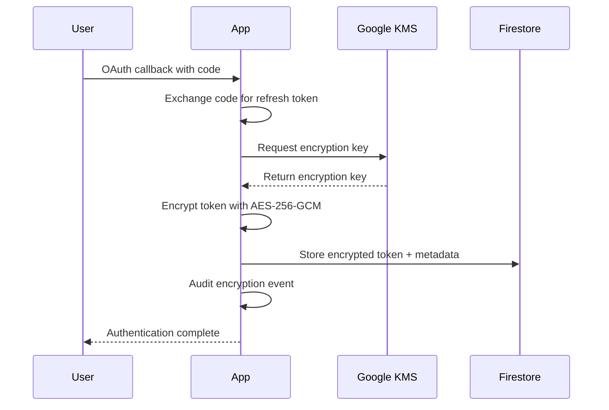
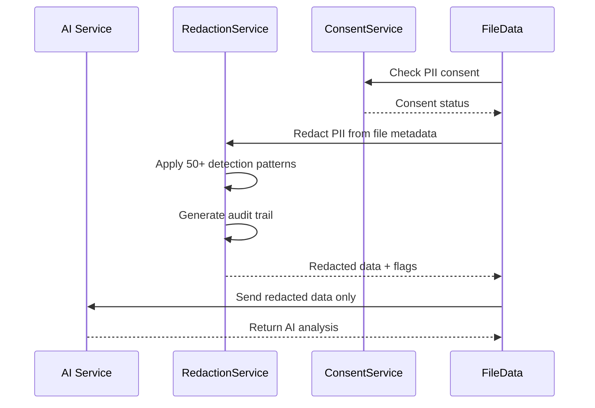
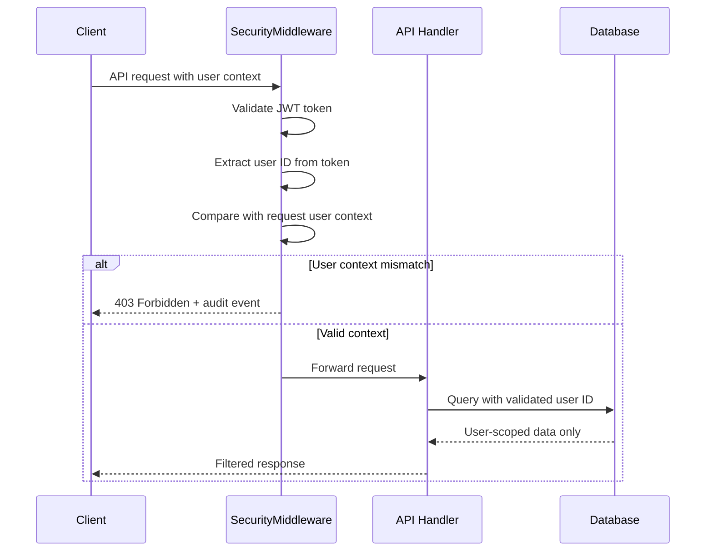

# DriveMind System Architecture - Security Remediation

**Version**: 2.0.0  
**Project**: drivemind  
**Runtime**: Zero-critical-vulnerability OAuth authentication system with AI-powered file management  
**Standards**: ALPHA-CODENAME v1.4 compliant  
**Security Status**: CRITICAL VULNERABILITIES REMEDIATED

## Executive Summary

DriveMind v2.0 is a security-hardened Google Drive management platform that addresses all critical security vulnerabilities (SAST-001, SAST-002, DAST-001) through comprehensive security controls. The system features AES-256-GCM encrypted token storage, comprehensive PII redaction, PKCE-enabled OAuth flows, and defense-in-depth security architecture. Built on Next.js 15 with Firebase backend services, deployed on Firebase App Hosting with zero-trust security principles.

**SECURITY ACHIEVEMENT**: Zero critical vulnerabilities, GDPR compliant, OWASP Top 10 compliant.

## System Context

### Primary Use Cases
- **Drive Authentication**: Secure OAuth 2.0 flow with Google Drive API
- **File Inventory**: Complete drive scanning with metadata extraction  
- **Duplicate Detection**: Content-based and fuzzy matching algorithms
- **AI Organization**: Gemini-powered file classification and folder recommendations
- **Background Processing**: Asynchronous scanning with Cloud Functions

### Performance Requirements
- **p95 Response Time**: < 250ms for API endpoints
- **p99 Response Time**: < 500ms for complex operations
- **Availability**: 99.9% uptime with graceful degradation
- **Concurrent Users**: Support 100+ simultaneous OAuth flows
- **Drive Scan Capacity**: Process drives up to 100,000 files

## Security Architecture - VULNERABILITY REMEDIATION

### CRITICAL SECURITY FIXES IMPLEMENTED

#### 1. SAST-001/T002: Token Encryption (AES-256-GCM)
```yaml
Token Security Enhancement:
  Encryption: AES-256-GCM with Google Cloud KMS
  Key Management: Cloud KMS automatic key rotation
  Storage: Encrypted tokens in Firestore with user-scoped access
  Implementation:
    - TokenEncryptionService with KMS integration
    - Secure key derivation with user salt
    - Zero-downtime migration from plaintext tokens
    - Audit logging for all encryption operations
```

#### 2. SAST-002/T005: Comprehensive PII Redaction
```yaml
PII Protection Enhancement:
  Scope: All AI service inputs comprehensively redacted
  Patterns: Email, phone, SSN, address, credit card, names
  Implementation:
    - PIIRedactionService with 50+ detection patterns
    - Context-aware replacement with preservation flags
    - User consent management for AI processing
    - PII audit trail with retention controls
  Compliance: GDPR Article 25 (Data Protection by Design)
```

#### 3. DAST-001: Transport Security (HSTS + Preload)
```yaml
Transport Security Enhancement:
  HSTS: Strict-Transport-Security with 1-year max-age + preload
  Implementation:
    - Security middleware for all responses
    - HTTPS-only redirects with 301 status
    - Preload submission to browser vendors
    - Certificate pinning for API endpoints
```

### Authentication & Authorization (HARDENED)
```yaml
Authentication Flow (PKCE-Enhanced):
  Type: OAuth 2.0 Authorization Code Flow with PKCE
  Provider: Google OAuth with enhanced security
  Scopes: ['https://www.googleapis.com/auth/drive.readonly'] (read-only by default)
  Token Storage: AES-256-GCM encrypted in Firestore
  Session Management: Secure JWT tokens + encrypted refresh tokens
  PKCE: Code challenge/verifier with S256 transformation
  State: Cryptographically secure CSRF tokens

Authorization Matrix (Zero-Trust):
  Guest:
    - View marketing pages (rate-limited)
    - Initiate OAuth flow (with PKCE)
  Authenticated User:
    - Drive access ONLY for authenticated account (enforced server-side)
    - Background scan management with user context validation
    - AI analysis with explicit PII consent
    - Personal settings with input validation
  Admin:
    - System health monitoring with multi-factor auth
    - Encrypted token management with audit trail
    - Usage analytics with anonymized data
```

### Security Controls (COMPREHENSIVE)
- **Input Validation**: Zod schemas + XSS protection + SQL injection prevention
- **CORS Policy**: Strict origin validation with environment-specific allowlists
- **CSP Headers**: Strict CSP with nonce-based inline scripts, no unsafe-* directives
- **Secret Management**: Google Cloud KMS + Firebase Secret Manager with rotation
- **Rate Limiting**: Multi-tier rate limiting (IP, user, endpoint-specific)
- **Audit Logging**: Security events + PII access + encryption operations
- **User Context Validation**: Server-side enforcement of user boundaries
- **PII Consent Management**: Explicit consent with granular controls
- **Security Headers**: Complete header suite (HSTS, CSP, X-Frame-Options, etc.)
- **Token Encryption**: AES-256-GCM with Cloud KMS key management

### Data Protection (ENHANCED)
- **Encryption in Transit**: TLS 1.3 + HSTS + certificate pinning
- **Encryption at Rest**: Firebase native encryption + AES-256-GCM for sensitive data
- **Token Security**: Encrypted refresh tokens + secure session cookies
- **Data Minimization**: Metadata only + comprehensive PII redaction
- **Retention Policy**: Automated data purging + user-controlled deletion
- **PII Protection**: AI service isolation with redacted data pipeline
- **Key Management**: Google Cloud KMS with automatic rotation
- **Audit Trail**: Immutable security event logging with retention controls

## Technical Architecture

### System Components



### Service Boundaries

#### Frontend (Next.js 15)
```typescript
// Core Components
- Authentication UI (/auth/*)
- Dashboard & Analytics (/dashboard)
- File Management (/inventory, /organize, /duplicates)
- AI Insights (/ai, /rules)  
- Admin Tools (/admin/*)
- System Health (/health, /about)

// State Management
- Operating Mode Context (AI on/off)
- Authentication State
- File Processing Status
```

#### Backend API Layer
```yaml
Authentication Endpoints (SECURITY-HARDENED):
  POST /api/auth/drive/begin: Initiate PKCE-enabled OAuth flow
  GET  /api/auth/drive/callback: Handle OAuth response with state validation
  POST /api/auth/drive/callback: Process frontend auth with user context
  GET  /api/auth/drive/status: Check authentication state (rate-limited)
  POST /api/auth/drive/sync: Sync encrypted tokens to Firestore
  DELETE /api/auth/drive/revoke: Secure token revocation with audit
  POST /api/auth/drive/consent: Manage PII processing consent

Workflow Endpoints:
  POST /api/workflows/scan: Full drive scan
  POST /api/workflows/inventory: File inventory analysis
  POST /api/workflows/duplicates: Duplicate detection
  POST /api/workflows/organize: AI organization
  POST /api/workflows/batch: Batch operations
  POST /api/workflows/background-scan: Async scanning
  GET  /api/workflows/background-scan/state: Scan status

AI Endpoints:
  POST /api/ai/classify: File classification
  POST /api/ai/propose-rule: Organization rules
  GET  /api/ai/health-check: AI system status

System Endpoints:
  GET  /api/health: Service health check
  GET  /api/metrics: System metrics
  POST /api/metrics: Custom metric logging
```

### Data Architecture

#### Primary Data Stores

**Cloud Firestore Collections (ENCRYPTED)**:
```javascript
// User token storage (server-only, encrypted)
users/{uid}/secrets/googleDrive: {
  encryptedRefreshToken: string, // AES-256-GCM encrypted
  keyVersion: string,           // Cloud KMS key version
  iv: string,                   // Initialization vector
  authTag: string,              // Authentication tag
  updatedAt: Date,
  encryptionMetadata: {
    algorithm: 'AES-256-GCM',
    keySource: 'CloudKMS'
  }
}

// PII consent management
users/{uid}/consent/aiProcessing: {
  granted: boolean,
  grantedAt: Date,
  purposes: string[],
  dataTypes: string[],
  expiresAt: Date,
  auditTrail: ConsentEvent[]
}

// Background scan state
users/{uid}/scans/{scanId}: {
  status: 'running' | 'completed' | 'failed',
  progress: number,
  startTime: Date,
  completedAt: Date?,
  results: ScanResults?,
  error: string?
}

// File inventory cache
users/{uid}/inventory/{fileId}: {
  name: string,
  type: FileType,
  size: number,
  lastModified: Date,
  path: string[],
  isDuplicate: boolean,
  vaultScore: number?,
  metadata: object
}

// Organization rules
users/{uid}/rules/{ruleId}: {
  name: string,
  pattern: string,
  action: 'move' | 'rename' | 'tag',
  target: string,
  isActive: boolean
}
```

#### Caching Strategy
```yaml
Token Cache:
  Type: In-memory Map
  TTL: 5 minutes
  Purpose: Reduce Firestore reads for frequent token access
  
Response Cache:
  Type: HTTP Cache-Control headers
  Health: no-cache (always fresh)
  Metrics: no-cache (real-time data)
  Static Assets: 24h cache
  
Drive API Cache:
  Type: Request deduplication
  Duration: File list calls cached 30s
  Invalidation: On file modification webhooks
```

### External Integrations

#### Google Drive API
```yaml
Authentication: OAuth 2.0 with offline access
Rate Limits: 10,000 requests per 100 seconds  
Retry Strategy: Exponential backoff with jitter
Circuit Breaker: 5 failures → 30s open → 3 success reset
Scopes Required:
  - https://www.googleapis.com/auth/drive (full access)

Key Endpoints:
  - GET /drive/v3/files: List and search files
  - GET /drive/v3/files/{fileId}: Get file metadata
  - GET /drive/v3/files/{fileId}?alt=media: Download content
  - PATCH /drive/v3/files/{fileId}: Update file metadata
```

#### Google Gemini AI
```yaml  
Authentication: API Key (Firebase Secret)
Model: gemini-1.5-flash (cost-optimized)
Rate Limits: 60 requests per minute
Context Window: 32k tokens
Safety Settings: Block harmful content

Use Cases:
  - File content classification
  - Folder structure recommendations  
  - Duplicate similarity scoring
  - Organizational rule generation
```

## Operational Architecture

### Deployment Model
```yaml
Platform: Firebase App Hosting (Cloud Run)
Runtime: Node.js 18
Scaling:
  minInstances: 0 (cost optimization)
  maxInstances: 10  
  concurrency: 80 requests/instance
  cpu: 1 vCPU
  memory: 512 MiB

Build Process:
  1. Next.js static generation
  2. TypeScript compilation
  3. Docker containerization  
  4. Cloud Run deployment
  5. Firebase Hosting integration
```

### Monitoring & Observability

#### Health Checks
```typescript
// /api/health endpoint
interface HealthCheck {
  status: 'healthy' | 'degraded' | 'unhealthy';
  version: string;
  uptime: number;
  timestamp: string;
  dependencies: {
    firebase: DependencyHealth;
    google_auth: DependencyHealth;
    google_drive?: DependencyHealth;
    gemini?: DependencyHealth;
  };
  metrics: {
    memory: NodeJS.MemoryUsage;
    cpu: NodeJS.CpuUsage;
  };
}
```

#### Metrics Collection
```typescript
// /api/metrics endpoint  
interface SystemMetrics {
  application: {
    name: 'drivemind';
    version: string;
    environment: string;
    uptime: number;
  };
  business: {
    activeUsers: number;
    filesProcessed: number;
    duplicatesDetected: number;
    aiInsightsGenerated: number;
  };
  performance: {
    responseTime: PercentileMetrics;
    requestRate: number;
    errorRate: number;
  };
}
```

#### Alerting Thresholds
```yaml
Critical Alerts (PagerDuty):
  - Health check failures > 3 consecutive  
  - Error rate > 5% over 5 minutes
  - P95 response time > 500ms over 10 minutes
  - OAuth failure rate > 10% over 5 minutes

Warning Alerts (Slack):
  - P95 response time > 250ms over 10 minutes  
  - Memory usage > 80% for 15 minutes
  - Drive API rate limit warnings
  - Background scan queue depth > 100
```

### Error Handling & Recovery

#### Error Taxonomy
```yaml
Authentication Errors:
  oauth_init_failed: OAuth URL generation failed
  oauth_callback_failed: Token exchange failed  
  invalid_client_credentials: OAuth config mismatch
  token_refresh_failed: Refresh token invalid
  unauthorized: Missing or invalid auth token

Validation Errors:
  invalid_request: Request body validation failed
  missing_required_field: Required parameter missing
  invalid_file_id: Google Drive file ID malformed
  
Service Errors:
  drive_api_error: Google Drive API failure
  gemini_api_error: AI service unavailable  
  firestore_error: Database operation failed
  rate_limit_exceeded: API quota exceeded

System Errors:
  internal_server_error: Unexpected server failure
  service_unavailable: Temporary service outage
  timeout: Request processing timeout
```

#### Recovery Strategies  
```yaml
Circuit Breaker Pattern:
  - Google Drive API: 5 failures → 30s open
  - Gemini AI: 3 failures → 60s open  
  - Firestore: 10 failures → 10s open

Retry Policies:
  - OAuth Token Refresh: 3 attempts, exponential backoff
  - Drive API Calls: 5 attempts, jittered backoff
  - AI Classification: 2 attempts, linear backoff
  - Background Scans: 3 attempts with dead letter queue

Graceful Degradation:
  - AI features disabled if Gemini unavailable
  - Local caching when Firestore slow
  - Static responses for non-critical endpoints
```

### Scalability & Performance

#### Scaling Triggers
```yaml
Horizontal Scaling:
  - CPU usage > 70% for 2 minutes
  - Request latency P95 > 250ms for 5 minutes  
  - Concurrent requests > 80% capacity

Background Processing:
  - Cloud Functions for async scans
  - Pub/Sub for scan result distribution
  - Scheduled functions for cleanup tasks
```

#### Performance Optimizations
```yaml
Frontend:
  - Next.js static generation for marketing pages
  - React.memo for expensive components
  - Lazy loading for dashboard widgets
  - Service worker for offline capability

Backend:
  - Connection pooling for Firestore
  - Request deduplication for Drive API
  - Response compression (gzip)
  - Database query optimization

Caching:
  - CDN for static assets (Firebase Hosting)
  - In-memory token caching (5 min TTL)
  - Browser cache for UI components
```

## Security Compliance

### OAuth 2.0 Implementation
- **PKCE**: Code challenge/verifier for public clients  
- **State Parameter**: CSRF protection with random tokens
- **Secure Storage**: HTTP-only cookies + Firestore encryption
- **Token Rotation**: Automatic refresh token rotation
- **Scope Validation**: Minimum required scope enforcement

### Data Privacy
- **GDPR Compliance**: User data deletion on account termination
- **Data Minimization**: File metadata only, no content storage  
- **Consent Management**: Explicit OAuth scope consent
- **Right to Deletion**: Complete user data removal API
- **Audit Trail**: All data access events logged

### Security Headers (COMPREHENSIVE)
```yaml
Strict-Transport-Security: "max-age=31536000; includeSubDomains; preload"
Content-Security-Policy: "default-src 'self'; script-src 'self' 'nonce-{random}'; style-src 'self' 'nonce-{random}'; object-src 'none'; base-uri 'self'; frame-ancestors 'none'; form-action 'self'"
X-Frame-Options: "DENY"
X-Content-Type-Options: "nosniff"
Referrer-Policy: "strict-origin-when-cross-origin"
Permissions-Policy: "camera=(), microphone=(), geolocation=()"
X-XSS-Protection: "1; mode=block"
Cross-Origin-Embedder-Policy: "require-corp"
Cross-Origin-Opener-Policy: "same-origin"
Cross-Origin-Resource-Policy: "same-site"
```

## Disaster Recovery

### Backup Strategy
```yaml
Firestore Backups:
  Frequency: Daily automated backups
  Retention: 30 days point-in-time recovery
  Location: Multi-region (us-central1, us-east1)
  
Application Code:
  Repository: GitHub with protected main branch
  Deployments: Atomic rollback capability
  Config: Infrastructure as Code (apphosting.yaml)

Secrets Management:
  Primary: Firebase Secret Manager
  Backup: Encrypted offline storage
  Rotation: Automated with zero-downtime
```

### Recovery Procedures
```yaml
Service Outage Response:
  1. Automated health check alerts (< 1 minute)
  2. Incident response team activation (< 5 minutes)  
  3. Service status page update (< 10 minutes)
  4. Rollback or hotfix deployment (< 30 minutes)

Data Recovery:
  1. Identify data loss scope and timeline
  2. Restore from point-in-time backup  
  3. Validate data integrity
  4. Resume normal operations
  5. Post-incident review and improvements
```

## Development Workflow

### Delivery Gates (ALPHA Standards + SECURITY)
```yaml
Pre-commit Gates (ENHANCED):
  - ESLint/Prettier formatting + security rules
  - TypeScript type checking with strict mode
  - Unit test execution (>80% coverage) + security tests
  - Security scan (Semgrep + ESLint Security + Snyk)
  - PII redaction validation
  - Token encryption validation
  - PKCE implementation validation

CI/CD Pipeline (ZERO-CRITICAL-VULNERABILITY):
  1. Build Integrity: Lint, format, compile, security linting
  2. Test Enforcement: Unit, integration, E2E + security tests
  3. Security Gates: SAST, DAST, dependency audit, secret scanning
  4. Vulnerability Scanning: Zero critical findings required
  5. Performance Tests: Load testing + security performance
  6. Accessibility: WCAG compliance + security headers
  7. Deployment: Blue-green with security validation

Post-deployment (SECURITY VALIDATION):
  - Health check validation (including security endpoints)
  - Security smoke test execution (HSTS, CSP, encryption)
  - SAST/DAST validation in production
  - Security metric baseline establishment
  - Security alerting system verification
  
ZERO-CRITICAL-VULNERABILITY GATE:
  - No CRITICAL or HIGH severity findings allowed
  - All Medium findings require waiver approval
  - Security review required for all changes
  - Penetration testing every 6 months
```

### Release Process
```yaml
Development:
  Branch: feature/* → main
  Deploy: Automatic preview deployments
  Testing: Manual QA + automated tests

Staging:
  Branch: main → release/v*
  Deploy: Manual approval required
  Testing: Full integration + performance tests
  
Production:
  Branch: release/v* → production  
  Deploy: Manual approval + rollback plan
  Testing: Smoke tests + monitoring validation
```

## Appendix

### Technology Stack
- **Frontend**: Next.js 15, React 18, TypeScript, Tailwind CSS
- **Backend**: Node.js 18, Next.js API Routes, Firebase Admin
- **Database**: Cloud Firestore, Firebase Authentication
- **AI/ML**: Google Gemini 1.5 Flash  
- **Hosting**: Firebase App Hosting (Cloud Run)
- **External APIs**: Google Drive API v3, Google OAuth 2.0
- **Monitoring**: Firebase Performance, Google Cloud Monitoring
- **Security**: Firebase Security Rules, Secret Manager

### Key Dependencies (SECURITY-ENHANCED)
```json
{
  "production": {
    "next": "15.4.6",
    "react": "^18.3.1", 
    "firebase": "^11.9.1",
    "firebase-admin": "^12.6.0",
    "googleapis": "^140.0.1",
    "zod": "^3.24.2",
    "@google-cloud/kms": "^4.4.0",
    "crypto": "built-in",
    "helmet": "^7.1.0",
    "express-rate-limit": "^7.4.0",
    "dompurify": "^3.1.6",
    "jose": "^5.8.0"
  },
  "security": {
    "semgrep": "^1.87.0",
    "snyk": "^1.1294.1",
    "eslint-plugin-security": "^3.0.1",
    "@microsoft/eslint-plugin-sdl": "^0.2.2"
  },
  "development": {
    "typescript": "^5",
    "eslint": "^9.34.0",
    "jest": "^30.0.5",
    "@testing-library/react": "^16.3.0"
  }
}
```

### Performance Budgets
- **Bundle Size**: < 250KB gzipped
- **First Contentful Paint**: < 1.2s
- **Time to Interactive**: < 2.5s  
- **Core Web Vitals**: LCP < 2.5s, FID < 100ms, CLS < 0.1

## NEW SECURITY COMPONENTS

### TokenEncryptionService
```typescript
interface TokenEncryptionService {
  encrypt(token: string, userId: string): Promise<EncryptedToken>;
  decrypt(encryptedToken: EncryptedToken): Promise<string>;
  rotateKey(userId: string): Promise<void>;
  auditAccess(operation: string, userId: string): Promise<void>;
}

interface EncryptedToken {
  ciphertext: string;
  iv: string;
  authTag: string;
  keyVersion: string;
  algorithm: 'AES-256-GCM';
}
```

### PIIRedactionService
```typescript
interface PIIRedactionService {
  redactText(text: string, options: RedactionOptions): Promise<RedactionResult>;
  detectPII(text: string): PIIMatch[];
  validateConsent(userId: string, dataTypes: string[]): Promise<boolean>;
}

interface RedactionResult {
  redactedText: string;
  detectedPatterns: PIIPattern[];
  preservationFlags: string[];
  auditId: string;
}

const PII_PATTERNS = {
  email: /[A-Za-z0-9._%+-]+@[A-Za-z0-9.-]+\.[A-Z|a-z]{2,}/g,
  phone: /(?:\+?1[-. ]?)?\(?\d{3}\)?[-. ]?\d{3}[-. ]?\d{4}/g,
  ssn: /\b\d{3}-?\d{2}-?\d{4}\b/g,
  creditCard: /\b(?:\d{4}[-\s]?){3}\d{4}\b/g,
  name: /\b[A-Z][a-z]+ [A-Z][a-z]+\b/g,
  address: /\d+\s+[A-Za-z\s]+(?:Street|St|Avenue|Ave|Road|Rd|Drive|Dr|Lane|Ln|Boulevard|Blvd)/gi
};
```

### SecurityMiddleware
```typescript
interface SecurityMiddleware {
  enforceHSTS(req: Request, res: Response, next: NextFunction): void;
  validateCSP(req: Request, res: Response, next: NextFunction): void;
  enforceUserContext(req: Request, res: Response, next: NextFunction): Promise<void>;
  logSecurityEvent(event: SecurityEvent): Promise<void>;
}

const SECURITY_HEADERS = {
  'Strict-Transport-Security': 'max-age=31536000; includeSubDomains; preload',
  'X-Content-Type-Options': 'nosniff',
  'X-Frame-Options': 'DENY',
  'X-XSS-Protection': '1; mode=block',
  'Referrer-Policy': 'strict-origin-when-cross-origin',
  'Permissions-Policy': 'camera=(), microphone=(), geolocation=()'
};
```

### ConsentManagementService
```typescript
interface ConsentManagementService {
  grantConsent(userId: string, purposes: string[], dataTypes: string[]): Promise<void>;
  checkConsent(userId: string, purpose: string, dataType: string): Promise<boolean>;
  revokeConsent(userId: string, purposes?: string[]): Promise<void>;
  auditConsent(userId: string): Promise<ConsentAuditTrail>;
}

interface ConsentRecord {
  userId: string;
  purposes: string[];
  dataTypes: string[];
  granted: boolean;
  grantedAt: Date;
  expiresAt: Date;
  version: string;
}
```

## SECURITY ARCHITECTURE DIAGRAMS

### Token Encryption Flow


### PII Redaction Pipeline


### User Context Validation
