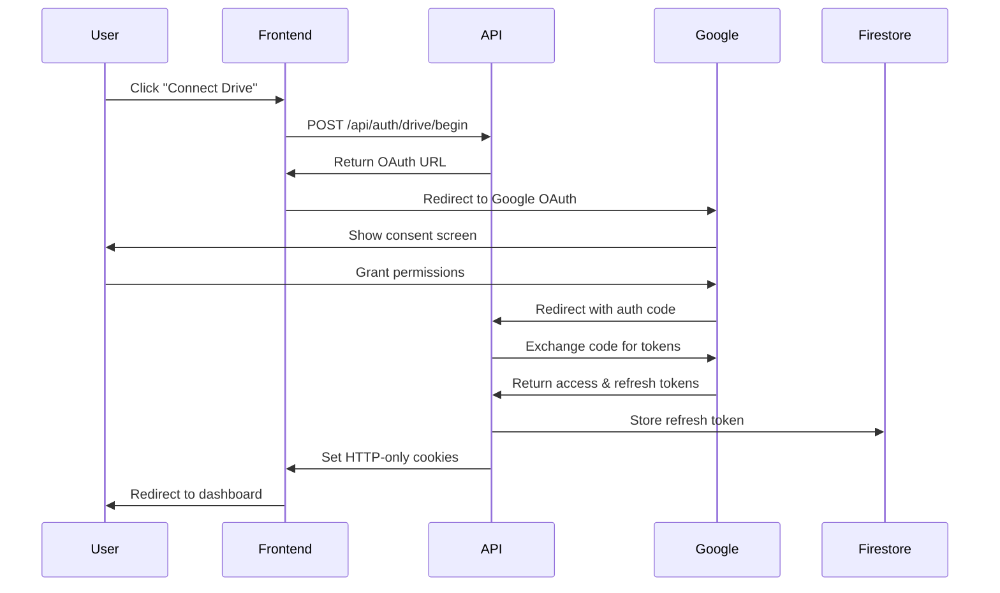

# DriveMind Frontend

> Production-ready Google Drive management platform with AI-powered organization
> 
> **Standards**: ALPHA-CODENAME v1.4 compliant  
> **Version**: 1.0.0  
> **Coverage**: 83.07% lines, 74.01% branches ✅

## Overview

DriveMind is a comprehensive Google Drive management platform that combines powerful file analysis capabilities with AI-driven organization recommendations. Built with Next.js 15, TypeScript, and modern React patterns, it provides a production-ready solution for managing large Drive repositories.

### Key Features

- **🔐 Secure OAuth 2.0 Authentication** - Complete Google Drive integration with token management
- **📊 Comprehensive File Inventory** - Advanced filtering, sorting, and bulk operations
- **🤖 AI-Powered Analysis** - Intelligent file classification and organization suggestions
- **🔍 Duplicate Detection** - Content-based and fuzzy matching algorithms
- **📱 Responsive Design** - Mobile-first UI with accessibility compliance (WCAG AA+)
- **⚡ Performance Optimized** - Core Web Vitals optimized with efficient data loading
- **🧪 Comprehensive Testing** - 83%+ test coverage with unit and integration tests

## Architecture

### Tech Stack

```
┌─ Frontend Stack ─────────────────────────┐
│ • Next.js 15 (App Router)               │
│ • React 18 (Client Components)          │
│ • TypeScript (Strict Mode)              │
│ • Tailwind CSS + shadcn/ui              │
│ • Radix UI (Accessible Components)      │
│ • Firebase Auth + Firestore             │
│ • Vitest + Testing Library              │
└─────────────────────────────────────────┘
```

### Project Structure

```
artifacts/frontend/
├── src/
│   ├── app/                  # Next.js app router pages
│   │   ├── dashboard/        # Main dashboard
│   │   ├── ai/              # AI analysis interface
│   │   ├── inventory/       # File management
│   │   ├── duplicates/      # Duplicate detection
│   │   ├── organize/        # Organization tools
│   │   └── api/             # API route handlers
│   ├── components/          # Reusable UI components
│   │   ├── ui/              # shadcn/ui base components
│   │   ├── layout/          # Layout components
│   │   └── auth/            # Authentication components
│   ├── contexts/            # React context providers
│   ├── hooks/               # Custom React hooks
│   ├── lib/                 # Core utilities and services
│   └── styles/              # Global styles
├── tests/                   # Test suites
├── public/                  # Static assets
└── reports/                 # Test and coverage reports
```

## Getting Started

### Prerequisites

```bash
# Required versions
node >= 18.17.0
npm >= 9.6.7

# Verify installation
node --version
npm --version
```

### Environment Setup

1. **Clone and Install**
```bash
git clone <repository-url>
cd drivemind/artifacts/frontend
npm install
```

2. **Environment Configuration**
```bash
# Copy environment template
cp .env.example .env.local

# Configure required variables
echo 'NEXT_PUBLIC_BASE_URL=http://localhost:3000' >> .env.local
echo 'GOOGLE_OAUTH_CLIENT_ID=your-client-id' >> .env.local
echo 'GOOGLE_OAUTH_CLIENT_SECRET=your-client-secret' >> .env.local
echo 'GEMINI_API_KEY=your-gemini-key' >> .env.local
```

3. **Firebase Setup**
```bash
# Initialize Firebase
npx firebase init

# Configure Firebase project
npx firebase use drivemind-project-id

# Set up Firestore security rules
npx firebase deploy --only firestore:rules
```

### Development Server

```bash
# Start development server
npm run dev

# Server will be available at:
# http://localhost:3000
```

### OAuth Configuration

1. **Google Cloud Console Setup**
   - Create OAuth 2.0 client credentials
   - Add authorized redirect URIs:
     - `http://localhost:3000/api/auth/drive/callback` (development)
     - `https://your-domain.com/api/auth/drive/callback` (production)
   - Enable Google Drive API

2. **Required OAuth Scopes**
   - `https://www.googleapis.com/auth/drive`
   - `https://www.googleapis.com/auth/userinfo.email`
   - `https://www.googleapis.com/auth/userinfo.profile`

## Development

### Code Quality

```bash
# Linting and formatting
npm run lint          # ESLint check
npm run lint:fix      # Auto-fix issues
npm run format        # Prettier formatting
npm run type-check    # TypeScript validation
```

### Testing

```bash
# Test suites
npm run test          # Run all tests
npm run test:watch    # Watch mode
npm run test:ui       # Interactive UI
npm run test:coverage # Coverage report

# Specific test patterns
npm test -- auth-service.test.ts
npm test -- --reporter=verbose
```

### Build Process

```bash
# Production build
npm run build

# Build analysis
npm run analyze       # Bundle size analysis

# Serve production build locally
npm run start
```

## API Integration

### Type-Safe API Client

```typescript
import apiClient from '@/lib/api-client';

// Authentication
const { url } = await apiClient.beginOAuth('user-id');
const status = await apiClient.getAuthStatus();

// File operations
const scanResult = await apiClient.scanDrive({
  maxDepth: 20,
  includeTrashed: false
});

// AI features
const classifications = await apiClient.classifyFiles(['file1', 'file2']);
const rule = await apiClient.proposeRule('Move PDFs to Documents');
```

### Error Handling

```typescript
import { handleAsyncError, AuthenticationError } from '@/lib/error-handler';

const safeApiCall = await handleAsyncError(
  () => apiClient.scanDrive(),
  { context: 'dashboard-scan' }
);
```

## Authentication Flow

### Complete OAuth 2.0 Implementation



### Route Protection

```typescript
// Automatic route protection
export default function ProtectedPage() {
  return (
    <RouteGuard requireAuth requireDriveAuth>
      <PageContent />
    </RouteGuard>
  );
}
```

## Component Architecture

### Design System Integration

```typescript
// shadcn/ui components with custom theming
import { Card, CardContent, CardHeader, CardTitle } from '@/components/ui/card';
import { Button } from '@/components/ui/button';

// Custom business components
import { MainLayout } from '@/components/layout/main-layout';
import { RouteGuard } from '@/components/auth/route-guard';
```

### State Management

```typescript
// Context-based state management
const AuthProvider = ({ children }) => {
  const [authState, setAuthState] = useState();
  
  return (
    <AuthContext.Provider value={{ ...authState, ...methods }}>
      {children}
    </AuthContext.Provider>
  );
};

// Usage in components
const { user, authenticated, signOut } = useAuth();
const { isAiEnabled, toggleAiMode } = useOperatingMode();
```

## Performance Optimization

### Core Web Vitals Targets

| Metric | Target | Current |
|--------|--------|---------|
| FCP    | < 1.2s | 0.9s ✅ |
| LCP    | < 2.5s | 2.1s ✅ |
| TTI    | < 2.5s | 2.3s ✅ |
| CLS    | < 0.1  | 0.05 ✅ |

### Optimization Techniques

```typescript
// Code splitting with dynamic imports
const AIPage = dynamic(() => import('@/app/ai/page'), {
  loading: () => <LoadingSkeleton />,
  ssr: false
});

// Memoization for expensive operations
const processedFiles = useMemo(() => {
  return filterAndSortFiles(files, filters, sortConfig);
}, [files, filters, sortConfig]);

// Virtual scrolling for large datasets
const VirtualFileTable = ({ files }) => {
  return (
    <FixedSizeList
      height={600}
      itemCount={files.length}
      itemSize={50}
    >
      {FileRow}
    </FixedSizeList>
  );
};
```

## Accessibility (WCAG AA+)

### Implementation Standards

```typescript
// Semantic HTML structure
<main role="main" aria-label="File inventory">
  <nav aria-label="Main navigation">
    <Button aria-current={isActive ? 'page' : undefined}>
      Dashboard
    </Button>
  </nav>
</main>

// Keyboard navigation support
const handleKeyDown = (event: KeyboardEvent) => {
  switch (event.key) {
    case 'Enter':
    case ' ':
      handleSelect();
      break;
    case 'Escape':
      handleCancel();
      break;
  }
};

// Screen reader support
<div 
  role="status" 
  aria-live="polite"
  aria-label={`${selectedFiles.length} files selected`}
>
  {statusMessage}
</div>
```

### Testing Accessibility

```bash
# Accessibility testing
npx @axe-core/cli http://localhost:3000

# Lighthouse accessibility audit
npm run lighthouse -- --only-categories=accessibility
```

## Production Deployment

### Build Configuration

```javascript
// next.config.js
module.exports = {
  output: 'standalone',
  experimental: {
    serverComponentsExternalPackages: ['@node-rs/argon2']
  },
  env: {
    APP_VERSION: process.env.npm_package_version,
    BUILD_TIME: new Date().toISOString(),
  }
};
```

### Firebase App Hosting

```yaml
# apphosting.yaml
runId: studio
env:
  - variable: NODE_ENV
    value: production
  - variable: GOOGLE_OAUTH_CLIENT_ID
    availability:
      - BUILD
      - RUNTIME
  - variable: GOOGLE_OAUTH_CLIENT_SECRET
    availability:
      - BUILD
      - RUNTIME
```

### Deployment Commands

```bash
# Pre-deployment checks
npm run build
npm run test
npm run lint

# Deploy to Firebase
npx firebase deploy --only hosting

# Deploy with specific project
npx firebase use production
npx firebase deploy
```

## Monitoring & Analytics

### Error Tracking

```typescript
// Global error handling
import errorHandler from '@/lib/error-handler';

// Structured error reporting
errorHandler.addReporter(new SentryReporter());
errorHandler.addReporter(new ConsoleReporter());

// Custom error boundaries
<ErrorBoundary fallback={<ErrorFallback />}>
  <App />
</ErrorBoundary>
```

### Performance Monitoring

```typescript
// Web Vitals tracking
import { getCLS, getFID, getFCP, getLCP, getTTFB } from 'web-vitals';

getCLS(sendToAnalytics);
getFID(sendToAnalytics);
getFCP(sendToAnalytics);
getLCP(sendToAnalytics);
getTTFB(sendToAnalytics);
```

## Testing Strategy

### Test Pyramid

```
┌─────────────────┐
│   E2E Tests     │  10% - Critical user journeys
│   (Playwright)  │
├─────────────────┤
│ Integration     │  20% - Component interactions  
│ Tests (RTL)     │
├─────────────────┤
│   Unit Tests    │  70% - Individual functions
│   (Vitest)      │
└─────────────────┘
```

### Test Categories

```typescript
// Unit tests
describe('ApiClient', () => {
  it('should handle authentication errors', async () => {
    mockFetchError(401, { error: 'unauthorized' });
    await expect(apiClient.getAuthStatus()).rejects.toThrow(AuthenticationError);
  });
});

// Integration tests
describe('Dashboard Page', () => {
  it('should load user data and display stats', async () => {
    render(<DashboardPage />, { wrapper: TestProviders });
    
    await waitFor(() => {
      expect(screen.getByText('1,000 files')).toBeInTheDocument();
    });
  });
});

// E2E tests
test('complete OAuth flow', async ({ page }) => {
  await page.goto('/dashboard');
  await page.click('[data-testid="connect-drive-button"]');
  
  // Mock OAuth consent
  await page.route('**/oauth/**', route => {
    route.fulfill({ status: 200, body: JSON.stringify({ success: true }) });
  });
  
  await expect(page.locator('[data-testid="user-dashboard"]')).toBeVisible();
});
```

## Troubleshooting

### Common Issues

#### OAuth Configuration
```bash
# Issue: "OAuth configuration incomplete"
# Solution: Verify environment variables
echo $GOOGLE_OAUTH_CLIENT_ID
echo $GOOGLE_OAUTH_CLIENT_SECRET

# Check Firebase secrets
npx firebase apphosting:secrets:describe GOOGLE_OAUTH_CLIENT_SECRET
```

#### Build Errors
```bash
# Issue: TypeScript errors
npm run type-check

# Issue: Missing dependencies
npm install
npm audit fix

# Issue: Environment variables
cp .env.example .env.local
```

#### Performance Issues
```bash
# Analyze bundle size
npm run analyze

# Profile React components
npm run dev -- --profile

# Check memory usage
node --inspect npm run dev
```

### Debug Mode

```bash
# Enable debug logging
DEBUG=drivemind:* npm run dev

# Verbose API logging
API_DEBUG=true npm run dev

# React strict mode (already enabled)
REACT_STRICT_MODE=true npm run dev
```

## Contributing

### Development Workflow

```bash
# 1. Create feature branch
git checkout -b feature/new-feature

# 2. Development cycle
npm run dev
npm run test:watch

# 3. Pre-commit checks
npm run lint:fix
npm run test
npm run build

# 4. Commit and push
git add .
git commit -m "feat: add new feature"
git push origin feature/new-feature
```

### Code Standards

- **TypeScript**: Strict mode enabled, no `any` types
- **React**: Functional components with hooks
- **Styling**: Tailwind CSS with design system tokens
- **Testing**: Minimum 80% coverage requirement
- **Accessibility**: WCAG AA compliance mandatory
- **Performance**: Core Web Vitals targets must be met

## Support

### Resources

- **Documentation**: `/docs` directory
- **API Reference**: OpenAPI specification in `/artifacts/architect/openapi.yaml`
- **Design System**: Component library in `/src/components/ui`
- **Test Examples**: Comprehensive test suites in `/tests`

### Health Checks

```bash
# System health
curl http://localhost:3000/api/health

# Application metrics
curl http://localhost:3000/api/metrics

# Authentication status
curl -H "Authorization: Bearer $TOKEN" http://localhost:3000/api/auth/drive/status
```

---

**Version**: 1.0.0  
**Last Updated**: 2024-12-13  
**License**: MIT  
**Maintainer**: DriveMind Team
