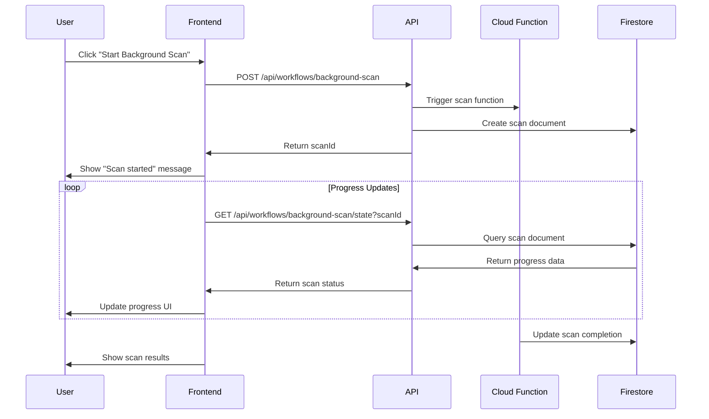

# DriveMind User Flows

**Version**: 1.0.0  
**Project**: drivemind  
**Standards**: ALPHA-CODENAME v1.4 compliant  
**Generated**: 2025-09-12

## Executive Summary

Complete user flow specification for DriveMind's Google Drive management platform. Covers authentication, file management, AI analysis, and admin workflows with comprehensive error handling and accessibility considerations.

## Primary User Flows

### 1. Initial Authentication Flow

**Trigger**: User visits application without valid auth token  
**Entry Points**: `/`, `/dashboard`, `/ai`, `/inventory`, `/duplicates`, `/organize`, `/rules`  
**Success Outcome**: User authenticated with Google Drive access  
**Failure Outcomes**: OAuth errors, token refresh failures, permission denials

#### Flow Steps

1. **Landing/Redirect Detection**
   - User visits any protected route
   - System checks authentication status via `/api/auth/drive/status`
   - If unauthenticated, redirect to landing page with auth prompt

2. **OAuth Initiation**
   - User clicks "Connect Google Drive" button
   - System calls `POST /api/auth/drive/begin`
   - Generate OAuth URL with PKCE and state parameters
   - Redirect user to Google OAuth consent screen

3. **Google OAuth Consent**
   - User sees Google Drive permission screen
   - Required scope: `https://www.googleapis.com/auth/drive`
   - User grants/denies permission

4. **OAuth Callback Processing**
   - Google redirects to `/api/auth/drive/callback`
   - System validates state parameter (CSRF protection)
   - Exchange authorization code for tokens
   - Store refresh token in Firestore (encrypted)
   - Set HTTP-only session cookies

5. **Post-Authentication Sync**
   - Frontend calls `POST /api/auth/drive/sync`
   - Verify token storage and accessibility
   - Redirect to intended destination or `/dashboard`

#### Error Handling

```yaml
oauth_init_failed:
  cause: OAuth URL generation failure
  action: Show error toast, retry button
  fallback: Contact support link

oauth_callback_failed:
  cause: Token exchange failure
  action: Clear cookies, restart flow
  fallback: Manual retry with troubleshooting guide

invalid_client_credentials:
  cause: OAuth configuration mismatch
  action: System alert, admin notification
  fallback: Service status page

token_refresh_failed:
  cause: Refresh token expired/revoked
  action: Re-authentication required
  fallback: Clear all auth state
```

### 2. Dashboard Overview Flow

**Trigger**: Authenticated user visits `/dashboard`  
**Entry Point**: Post-authentication redirect or navigation  
**Success Outcome**: User sees drive overview and activity metrics  
**Failure Outcomes**: API timeouts, permission errors, empty state

#### Flow Steps

1. **Dashboard Load**
   - Render dashboard skeleton/loading state
   - Call `GET /api/dashboard/stats` for metrics
   - Display stats cards with real-time data

2. **Drive Status Check**
   - Verify Google Drive API connectivity
   - Show last scan timestamp and file counts
   - Display recent activity feed

3. **Action Prompts**
   - If no recent scan: Prompt for initial scan
   - If duplicates found: Show duplicate detection CTA
   - If AI enabled: Show AI analysis opportunities

#### States

```yaml
loading:
  skeleton: StatsCards with shimmer
  duration: <2s typical
  fallback: Static metrics if API slow

empty:
  condition: No previous scans
  content: Welcome message + "Start Your First Scan" CTA
  action: Navigate to /inventory with scan prompt

error:
  condition: API failures or auth issues
  content: Error message with retry button
  action: Refresh or re-authenticate
```

### 3. Drive Scanning Flow

**Trigger**: User initiates scan from `/inventory` or dashboard  
**Entry Point**: "Start Scan" button or background scan scheduler  
**Success Outcome**: Complete file inventory with metadata  
**Failure Outcomes**: API rate limits, permission errors, large drive timeouts

#### Flow Steps

1. **Scan Configuration**
   - User selects scan options:
     - Include trashed files (default: false)
     - Max depth (default: unlimited)
     - Scan shared drives (default: false)
   - Display estimated scan time based on previous runs

2. **Scan Execution**
   - For small drives (<1000 files): Synchronous scan
   - For large drives: Background scan with Cloud Functions
   - Real-time progress updates via polling or WebSocket
   - Display current folder being processed

3. **Progress Monitoring**
   - Progress bar with file count and percentage
   - Current operation status (e.g., "Scanning /Documents...")
   - Cancel scan option (graceful termination)
   - ETA based on processing rate

4. **Results Processing**
   - Store file metadata in Firestore cache
   - Generate duplicate analysis
   - AI classification if enabled
   - Update inventory view with results

#### Background Scan Flow



### 4. AI Analysis Flow

**Trigger**: User enables AI mode or requests file analysis  
**Entry Point**: `/ai` page or operating mode toggle  
**Success Outcome**: AI-powered file insights and organization suggestions  
**Failure Outcomes**: AI service unavailable, quota exceeded, content analysis errors

#### Flow Steps

1. **Operating Mode Toggle**
   - User toggles AI mode in global context
   - Persist preference to localStorage
   - Show/hide AI features across application
   - Display AI quota usage if applicable

2. **File Classification**
   - User selects files for AI analysis
   - Batch processing (max 100 files per request)
   - Call `POST /api/ai/classify` with file IDs
   - Display classification results with confidence scores

3. **Organization Suggestions**
   - AI analyzes file patterns and naming conventions
   - Generates folder structure recommendations
   - Proposes automated organization rules
   - User can accept/reject/modify suggestions

4. **Rule Generation**
   - User describes organization intent in natural language
   - Call `POST /api/ai/propose-rule` with description
   - AI generates executable rule with pattern matching
   - Preview rule effects before activation

#### AI Feature States

```yaml
ai_enabled:
  global_state: OperatingModeContext.isAiEnabled = true
  ui_changes:
    - Show AI analysis buttons
    - Display classification scores
    - Enable smart organization
    - Show AI-generated suggestions

ai_disabled:
  global_state: OperatingModeContext.isAiEnabled = false
  ui_changes:
    - Hide AI features
    - Show basic file operations only
    - Disable smart suggestions
    - Manual organization only

ai_unavailable:
  condition: Gemini API down or quota exceeded
  ui_changes:
    - Show service unavailable message
    - Disable AI features temporarily
    - Fallback to manual operations
```

### 5. Duplicate Detection Flow

**Trigger**: User navigates to `/duplicates` or runs duplicate scan  
**Entry Point**: Navigation or dashboard CTA  
**Success Outcome**: Grouped duplicate files with action options  
**Failure Outcomes**: Algorithm timeouts, large file processing errors

#### Flow Steps

1. **Duplicate Analysis**
   - Load existing duplicate data from cache
   - If stale, trigger new analysis
   - Call `POST /api/workflows/duplicates`
   - Choose algorithm: content_hash, fuzzy_match, or combined

2. **Results Grouping**
   - Display duplicate groups by similarity
   - Similarity slider to adjust threshold
   - Show file details: size, date, location
   - Preview thumbnails for images/documents

3. **Batch Actions**
   - Select files for bulk operations
   - Actions: delete, move, rename, mark as favorite
   - Confirmation dialog with impact summary
   - Execute operations with progress tracking

4. **Smart Recommendations**
   - If AI enabled: Suggest which duplicates to keep
   - Consider factors: file location, modification date, size
   - Show reasoning for each recommendation
   - User can override AI suggestions

### 6. File Organization Flow

**Trigger**: User navigates to `/organize` or applies organization rules  
**Entry Point**: Navigation or AI suggestion  
**Success Outcome**: Files organized according to user-defined or AI-suggested rules  
**Failure Outcomes**: Rule conflicts, permission errors, bulk operation failures

#### Flow Steps

1. **Current Structure Analysis**
   - Display current folder structure
   - Highlight disorganized areas
   - Show file distribution statistics
   - Identify organization opportunities

2. **Rule Management**
   - View existing organization rules
   - Create new rules with pattern matching
   - Test rules against current files
   - Schedule automatic rule execution

3. **Batch Organization**
   - Apply rules to selected files or folders
   - Preview changes before execution
   - Show conflict resolution options
   - Execute with rollback capability

4. **AI-Powered Suggestions**
   - Generate organization recommendations
   - Propose folder structures based on content
   - Suggest file naming conventions
   - Learn from user organization patterns

### 7. Admin Management Flow

**Trigger**: Admin user accesses `/admin/*` routes  
**Entry Point**: Admin navigation or direct URL  
**Success Outcome**: System monitoring and user management  
**Failure Outcomes**: Permission denied, data access errors

#### Flow Steps

1. **Admin Authentication**
   - Verify admin role and permissions
   - Show admin dashboard with system metrics
   - Display user activity overview

2. **Token Management** (`/admin/drive-tokens`)
   - List all user OAuth tokens
   - Show token status and last refresh
   - Revoke tokens for security or debugging
   - Debug OAuth flow issues

3. **System Monitoring**
   - View health check status
   - Monitor API response times
   - Check external service dependencies
   - Review error logs and alerts

## Error Recovery Flows

### Authentication Recovery

```yaml
token_expired:
  detection: API returns 401 Unauthorized
  action: Automatic token refresh attempt
  fallback: Force re-authentication
  user_experience: Transparent (background) or login prompt

oauth_revoked:
  detection: Refresh token invalid
  action: Clear all auth state
  fallback: Fresh OAuth flow required
  user_experience: "Please reconnect your Google Drive"

rate_limit:
  detection: API returns 429 Too Many Requests
  action: Exponential backoff retry
  fallback: User notification with retry timer
  user_experience: "High traffic, please wait..."
```

### Service Degradation

```yaml
ai_unavailable:
  detection: Gemini API failures
  action: Disable AI features temporarily
  fallback: Manual file operations
  user_experience: "AI features temporarily unavailable"

drive_api_slow:
  detection: Response times >5s
  action: Show loading states, batch requests
  fallback: Cache previous results
  user_experience: Progress indicators, cancel options

firestore_errors:
  detection: Database operation failures
  action: Retry with exponential backoff
  fallback: Local storage for critical data
  user_experience: "Saving changes..." with retry option
```

## Mobile-Specific Flows

### Touch Navigation
- Swipe gestures for file operations
- Pull-to-refresh for scan updates
- Long-press context menus
- Responsive breakpoints: mobile (<768px), tablet (<1024px), desktop (≥1024px)

### Performance Optimizations
- Lazy loading for large file lists
- Virtual scrolling for inventory tables
- Progressive image loading for thumbnails
- Offline capability for basic operations

## Accessibility Flows

### Screen Reader Navigation
- Skip links to main content
- Proper heading hierarchy (h1 → h6)
- ARIA labels for complex interactions
- Focus management for modal dialogs

### Keyboard Navigation
- Tab order through all interactive elements
- Enter/Space for button activation
- Escape key for modal dismissal
- Arrow keys for table navigation

### High Contrast Mode
- Automatic detection of system preferences
- Manual toggle for high contrast colors
- Text scaling support (up to 200%)
- Color-independent information display

## Performance Requirements

```yaml
page_load:
  first_contentful_paint: <1.2s
  time_to_interactive: <2.5s
  largest_contentful_paint: <2.5s

api_response:
  p95_response_time: <250ms
  p99_response_time: <500ms
  error_rate: <1%

user_actions:
  button_feedback: <100ms
  navigation: <200ms
  scan_progress: real-time updates
```

## Monitoring & Analytics

### User Journey Tracking
- Authentication success/failure rates
- Feature adoption metrics
- Error occurrence by flow step
- Performance bottleneck identification

### Conversion Funnels
- Landing → Authentication → First Scan
- Scan → Duplicate Detection → Organization
- AI Feature Discovery → Usage → Retention

### Quality Metrics
- Task completion rates
- User satisfaction scores (NPS)
- Support ticket categorization
- Feature usage patterns